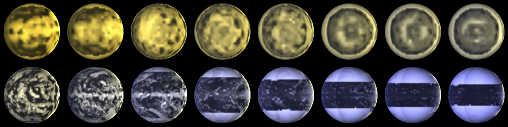

EXOPLASIM
======

*A range of planets modeled by ExoPlaSim, and postprocessed with SBDART. The top row consists of tidally-locked aquaplanets at T21 orbiting stars ranging from 2500 K to 4000 K, with orbital periods increasing with stellar mass. The bottom row consists of aquaplanets with 24-hour rotation at T42, orbiting stars ranging from 4000 K to 8000 K.*

The PlaSim 3D general climate model, extended for terrestrial planets. This model contains the PlaSim GCM, as well as all necessary modifications to run tidally-locked planets, planets with substantially different surface pressures than Earth, planets orbiting stars with different effective temperatures, super-Earths, and more. This model also includes the ability to compute carbon-silicate weathering, dynamic orography through the glacier module (though only accumulation and ablation/evaporation/melting are included; glacial flow and spreading are not), and storm climatology. Future features will include support for multiple celestial light sources (e.g. for a habitable moon orbiting a Jovian planet, or circumbinary planets), coupling with N-body integrators such as REBOUND, and CO2 condensation.

This model ships with a Python API, described below. Full documentation of the API is available at <http://exoplasim.readthedocs.io>.

Documentation of the original PlaSim model is found in exoplasim/plasim/doc.

 

ExoPlaSim Python API README
===========================

Created by Adiv Paradise

Copyright 2020, Distributed under the General Public License

This API was written with Python 3 in mind, but should work with Python
2 and outdated versions of NumPy.

Requirements
------------

-   netCDF4
-   numpy
-   scipy (only needed for additional utilities)
-   matplotlib (only needed for additional utilities)
-   a Fortran compiler
-   a C compiler
-   (optionally) MPI libraries for those compilers

Installation
------------

    pip install exoplasim

OR:

    python setup.py install

The first time you import the module and try to create a model after
either installing or updating, ExoPlaSim will run a configuration
script, write the install directory into its source code, and compile
the burn7 NetCDF postprocessor. You must have NetCDF libraries available
in the path when this happens. The burn7 compilation process will build
and compile a patched version of the NetCDF libraries necessary for
burn7--burn7 makes use of features anachronistic to a particular version
of NetCDF that no longer exists.

You may also configure and compile the model manually if you wish to not
use the Python API, by entering the exoplasim/ directory and running
first configure.sh, then compile.sh (compilation flags are shown by
running `./compile.sh -h`). The postprocessor and its libraries can be
compiled by entering `exoplasim/postprocessor/` and running
`./build_init.sh`.

PlaSim Documentation
--------------------

Original PlaSim documentation is available in the exoplasim/docs/
folder.

Usage
-----

To use the ExoPlaSim Python API, you must import the module, create a
Model or one of its subclasses, call its configure method and/or modify
method, and then run it.

Basic example::

    import exoplasim as exo
    mymodel = exo.Model(workdir="mymodel_testrun",modelname="mymodel",resolution="T21",layers=10,ncpus=8)
    mymodel.configure()
    mymodel.exportcfg()
    mymodel.run(years=100,crashifbroken=True)
    mymodel.finalize("mymodel_output")

In this example, we initialize a model that will run in the directory
"mymodel\_testrun", and has the name "mymodel", which will be used to
label output and error logs. The model has T21 resolution, or 32x64, 10
layers, and will run on 8 CPUs. By default, the compiler will use 8-byte
precision. 4-byte may run slightly faster, but possibly at the cost of
reduced stability. If there are machine-specific optimization flags you
would like to use when compiling, you may specify them as a string to
the optimization argument, e.g. `optimization='mavx'`. ExoPlaSim will
check to see if an appropriate executable has already been created, and
if not (or if flags indicating special compiler behavior such as
debug=True or an optimization flag are set) it will compile one. We then
configure the model with all the default parameter choices, which means
we will get a model of Earth. We then export the model configurations to
a `.cfg` file (named automatically after the model), which will allow
the model configuration to be recreated exactly by other users. We run
the model for 100 years, with error-handling enabled. Finally, we tell
the model to clean up after itself. It will take the most recent output
files and rename them after the model name we chose, and delete all the
intermediate output and configuration files.