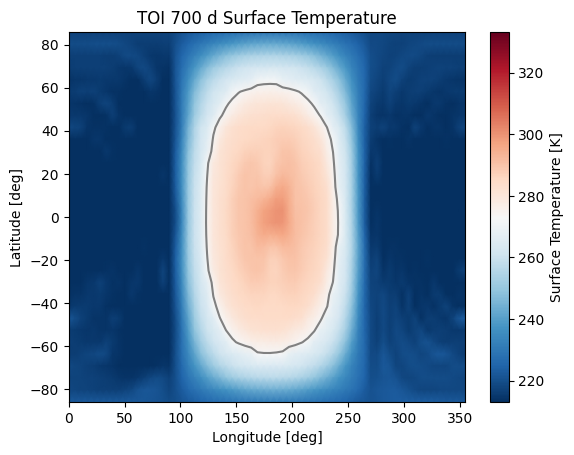
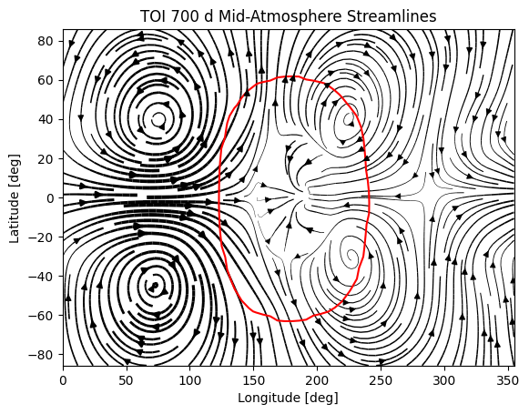
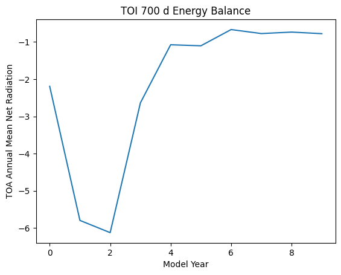
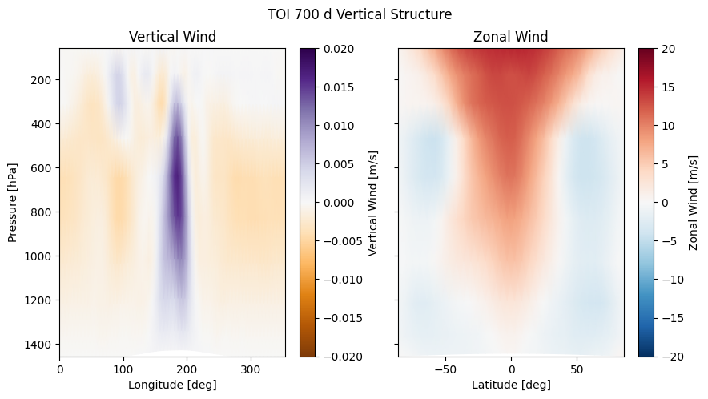
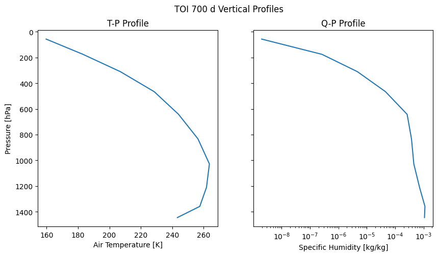

==================
ExoPlaSim Tutorial
==================

In this tutorial, we will model the habitable zone terrestrial planet TOI 700 d, and take a look at some of the data. This tutorial assumes that you have installed ExoPlaSim successfully, and have matplotlib installed.

Setting Up 
==========

First thing's first: we want to import ExoPlaSim, and instantiate our :py:mod:`Model <exoplasim.Model>` instance. We want to create our model run in the folder "toi700d_run", and run it at T21 resolution on 4 CPUs. We tell ExoPlaSim to use NumPy's compressed archive format for postprocessed output. Note that
a large number of output formats are supported, including netCDF and HDF5, but those two formats require
the additional installation of the ``netCDF4`` and ``h5py`` Python libraries (which can be done at 
install-time as optional dependencies for ExoPlaSim).

>>> import exoplasimlegacy as exo
>>> toi700d = exo.Model(workdir="toi700d_run",modelname="TOI-700d",
>>>                     ncpus=4,resolution="T21",outputtype=".npz")

If the appropriate executable does not yet exist, it will be compiled now. If this is the first time an ExoPlaSim model has been created, then a configuration script will be run first to locate the necessary compilers. We assign the model a descriptive name through the ``modelname`` argument, which is not strictly necessary, but will prove useful later.

Configuring the model for TOI-700d
----------------------------------

TOI 700 d was discovered by the TESS telescope in January 2020 `(Gilbert, et al 2020) <https://ui.adsabs.harvard.edu/link_gateway/2020AJ....160..116G/doi:10.3847/1538-3881/aba4b2>`_. It orbits TOI 700, a 3480 K M2V dwarf just over 100 lightyears away. TOI 700 has a luminosity of :math:`0.0233\pm0.0011` L\ :math:`_\odot`\ , and is relatively quiet. TOI 700 d has the following parameters:

+-----------------+-----------------------------------------------------------------------------------+
| Radius          | :math:`1.19\pm0.11` R\ :math:`_\oplus`                                            |
+-----------------+-----------------------------------------------------------------------------------+
| Mass            | :math:`1.72^{+1.29}_{-0.63}` M\ :math:`_\oplus`                                   |
+-----------------+-----------------------------------------------------------------------------------+
| Period          | :math:`37.4260^{+0.0007}_{-0.0010}` days                                          |
+-----------------+-----------------------------------------------------------------------------------+
| Semi-major Axis | :math:`0.163^{+0.0026}_{-0.0027}` AU                                              |
+-----------------+-----------------------------------------------------------------------------------+
| Incident Flux   | :math:`1367` W/m\ :math:`^2\left(\frac{L}{a^2}\right)\approx1199` W/m\ :math:`^2` |
+-----------------+-----------------------------------------------------------------------------------+
| Surface Gravity | :math:`9.81` m/s\ :math:`^2\left(\frac{M}{R^2}\right)\approx11.9` m/s\ :math:`^2` |
+-----------------+-----------------------------------------------------------------------------------+

We don't know anything else about the planet, so we'll have to make some assumptions about the atmosphere and surface. For simplicity, we'll assume that the surface is entirely ocean-covered, and that the atmospheric mass scales with planetary mass. We'll also assume that the atmosphere is N\ :sub:`2`\ , CO\ :sub:`2`\ , and H\ :sub:`2` \O. The surface pressure relative to Earth can therefore be estimated as follows:

.. math:: 
    p_s \approx \frac{g}{g_\oplus}\left(\frac{M}{M_\oplus}\right)\left(\frac{R_\oplus}{R}\right)^2
    
This gives a surface pressure of approximately 1.47 bars. With that figured out, we can proceed to configure the model (right now it is configured with the barest of defaults--you should always configure the model, even if you pass no non-default arguments).

>>> toi700d.configure(startemp=3480.0, flux=1167.0,                           # Stellar parameters
>>>                   eccentricity=0.,obliquity=0.,fixedorbit=True,           # Orbital parameters
>>>                   synchronous=True,rotationperiod=37.426,                 # Rotation
>>>                   radius=1.19,gravity=11.9,aquaplanet=True,               # Bulk properties
>>>                   pN2=1.47*(1-360e-6),pCO2=1.47*360e-6,ozone=False,       # Atmosphere
>>>                   timestep=30.0,snapshots=720,physicsfilter="gp|exp|sp")  # Model dynamics
>>> toi700d.exportcfg()

This command edits all the namelists and boundary condition files appropriately. The :py:func:`exportcfg() <exoplasim.Model.exportcfg>` command writes a portable text configuration file, by default named ``TOI-700d.cfg`` using the model's ``modelname`` parameter, that another user could use to replicate our model by simply running ``toi700d.loadconfig("TOI-700d.cfg")``.For a full description of the parameters we could have passed, see :py:func:`exoplasim.Model.configure() <exoplasim.Model.configure>`. Here is a brief overview of what each parameter did:

        startemp = 3480.0
            Specified the effective blackbody temperature of the star--in this case, 3480 K.
        flux = 1167.0
            Specified the incident flux (insolation or instellation) at the planet: 1167 W/m\ :math:`^2`
        eccentricity = 0.0
            We set the orbital eccentricity to 0.
        obliquity = 0.0
            We set the planet's axial tilt to 0.
        fixedorbit = True
            Here, we don't want the orbit precessing or anything, so we keep our orbit fixed.
        synchronous = True,
            By setting this flag, we have told ExoPlaSim that this is a tidally-locked model. The default is for the Sun to be fixed in place over 180° longitude.
        rotationperiod = 37.426
            Since the planet is tidally-locked, we assume its rotation period matches its orbital period, 37.426 days.
        radius = 1.19
            We set the planet's radius to 1.19 Earth radii.
        gravity = 11.9
            We set the surface gravity to 11.9 m/s\ :math:`^2`\ . Note that we do not specify the planet's mass directly, only the radius and surface gravity.
        aquaplanet = True
            Setting this flag deletes all surface boundary condition files and tells ExoPlaSim to initialize an ocean everywhere. The default is to have a mixed-layer depth of 50 meters.
        pN2 = 1.47*(1-360e-6)
            We want 1.47 bars **total**, but we want to include CO\ :sub:`2` as well. The surface pressure is the sum of the partial pressures, so we reduce pN\ :sub:`2` by the amount of CO\ :sub:`2` we want, the TOI 700 d equivalent of 360 :math:`\mu`\ bars. We could also skip the 1.47 scaling and set the pressure directly through its own argument.
        pCO2 = 1.47*360e-6
            We set the CO\ :sub:`2` partial pressure to its Earth level in bars, scaled up.
        ozone = False
            Since we are not assuming an oxygenated atmosphere (and some studies dispute how much ozone could be produced from an oxygenated atmosphere around an M dwarf anyway), we assume there will be no forcing from ozone. Tidally-locked models in ExoPlaSim are more stable without ozone anyway.
        timestep = 30.0
            Tidally-locked climates are stlightly more extreme than Earth-like climates, so rather than the default 45-minute timestep, we use 30 minutes.
        snapshots = 720
            Here we tell ExoPlaSim to write snapshot outputs every 720 timesteps (15 days). These snapshots show us the climate at a particular instant in time, and are therefore necessary for any observational postprocessing (any time-integrated observation is an average of photons that passed through the atmosphere as it was for a brief moment, not through the time-averaged atmosphere--this is mainly important for clouds). It's usually a good idea to write a snapshot every 15 days (twice a month), so scale based on the timestep. The default is to write every 480 timesteps, which is 15 days when a timestep is 15 minutes.
        physicsfilter = "gp|exp|sp"
            Tidally-locked models can be subject to large-scale Gibbs oscillations on the night side, due to the strong dipole moment of the forcing and axial symmetry of the iceline. **All models will struggle to reproduce sharp features accurately**. ExoPlaSim merely struggles in an extremely visible way. Fortunately, we can mitigate this to an acceptable level with the use of *physics filters*. These are mathematical filters included in the dynamical core at the spectral transform stage. Here we have told ExoPlaSim to use an exponential filter, and to apply it both at the transform from gridpoint space to spectral space, and at the transform from spectral space back to gridpoint space. For more details on the choice of filter and how they work, see :py:func:`exoplasim.Model.configure() <exoplasim.Model.configure>`. For Earth-like models that aren't tidally-locked, physics filters are usually not necessary.
            
Running the Model
=================

Now that we have configured the model, it's time to run it! This demo is intended to be something you can run on your laptop (thus specifying only 4 CPUs), so to make sure you have something to look at when you come back from your lunch break, let's just run for 10 years. On my laptop with 4 cores, a year takes just over 6 minutes. Note that on HPC architecture with 16 cores, a year often takes less than a minute.

>>> toi700d.run(years=10,crashifbroken=True)

The ``crashifbroken`` flag simply means that if something goes wrong, the model will crash in a slightly cleaner, Pythonic way. Note that a problem with the postprocessor will get flagged as a crash just like an actual model crash--in most cases, the model is salvageable if you figure out what went wrong with the postprocessor.

Inspecting the Data
===================

If all went well on that previous step, you should now have a bunch of NetCDF files sitting in the model's working directory. You can now open and analyze those as you wish. However, ExoPlaSim's Python API does provide some data inspection tools. Let's take a look at some of them. First, we'll plot the surface temperature, using `matplotlib <https://matplotlib.org/api/pyplot_api.html>`_.

>>> import matplotlib.pyplot as plt
>>> lon = toi700d.inspect("lon")
>>> lat = toi700d.inspect("lat")
>>> ts = toi700d.inspect("ts",tavg=True)
>>> im=plt.pcolormesh(lon,lat,ts,cmap="RdBu_r",vmin=273.15-60.0,vmax=273.15+60.0,shading="Gouraud")
>>> plt.contour(lon,lat,ts,[273.15,],colors=['gray',])
>>> plt.colorbar(im,label="Surface Temperature [K]")
>>> plt.xlabel("Longitude [deg]")
>>> plt.ylabel("Latitude [deg]")
>>> plt.title("TOI 700 d Surface Temperature")
>>> plt.show()

Neat! That does look like a tidally-locked planet. Note that when we requested the surface temperature, we specified ``tavg=True``, but nothing else besides the variable name. That told ExoPlaSim that we wanted a time average, and because we didn't specify otherwise, it gave us the time average of the final year of output. If we hadn't set ``tavg``, we would have gotten a 3-dimensional array, with the first dimension being time. If we wanted say the third year, we could have specified ``year=2`` (remember how Python indexing works). If we wanted to look at 3 years before the model finished, we could use ``year=-3``. For more information, refer to the documentation for :py:func:`inspect <exoplasim.Model.inspect>`.

How about something a bit more complex--say a 3-dimensional field, like wind? Airflow in ExoPlaSim is represented by 3 different fields: ``ua`` for zonal wind, ``va`` for meridional wind, and ``wa`` for vertical wind. In most climates you'll model with ExoPlaSim, wind is almost entirely horizontal, so we'll ignore ``wa`` for now. To get the overall wind speed, we'll need to combine ``ua`` and ``va``:

>>> import numpy as np
>>> ua = toi700d.inspect("ua",layer=5)
>>> va = toi700d.inspect("va",layer=5)
>>> speed = np.nanmean(np.sqrt(ua**2+va**2), axis=0)
>>> ua = np.nanmean(ua, axis=0)
>>> va = np.nanmean(va, axis=0)

Note that here we do the time-averaging *after* we do math on the variables--the function of an average is not always the average of the function. We've also now specified a ``layer`` argument, which extracts a particular vertical layer from a data field that has 3 spatial dimensions. Our model has 10 layers, so we extracted one of the middle layers, to show us the mid-altitude winds.

>>> from scipy.interpolate import interp2d
>>> ylat = np.linspace(lat.min(),lat.max(),lat.size) #ExoPlaSim latitudes are not evenly-spaced
>>> ux = interp2d(lon, lat, ua)(lon, ylat)
>>> vx = interp2d(lon, lat, va)(lon, ylat)
>>> speedx = interp2d(lon, lat, speed)(lon,ylat)

Here we've interpolated our windspeeds onto a new grid with an evenly-spaced y-axis--we have to do this because latitudes in ExoPlaSim are not evenly-spaced, and matplotlib's `streamplot <https://matplotlib.org/3.3.3/api/_as_gen/matplotlib.pyplot.streamplot.html>`_ routine requires an evenly-spaced grid.

>>> linewidth = 3*speedx / speedx.max()
>>> plt.streamplot(lon,ylat,ux,vx, density = 2, color='k', linewidth=linewidth)
>>> plt.contour(lon,lat,ts,[273.15,],colors=['r',])
>>> plt.xlabel("Longitude [deg]")
>>> plt.ylabel("Latitude [deg]")
>>> plt.title("TOI 700 d Mid-Atmosphere Streamlines")
>>> plt.show()

  
We can pretty clearly see here the night-side gyres, and the complex inflow-outflow behavior at the substellar point.

We've looked up until now only at the current year. What if we wanted to see how, say, the mean top-of-atmosphere energy balance evolved with each model year? 

The :py:func:`Model.gethistory <exoplasim.Model.gethistory>` routine provides the functionality we need. It will return an array of global annual averages for a given variable, for each simulated year:

>>> energybalance = toi700d.gethistory(key="ntr")
>>> plt.plot(energybalance)
>>> plt.xlabel("Model Year")
>>> plt.ylabel("TOA Annual Mean Net Radiation")
>>> plt.title("TOI 700 d Energy Balance")
>>> plt.show()

You'll notice here that we're not quite in equilibrium yet. That's because we only ran 10 years. Typically, reaching a strict energy balance equilibrium takes many decades, and sometimes up to a few centuries depending on how different the equilibrium is from the initial conditions. For a routine that will automatically run until an energy balance criterion is reached, see :py:func:`Model.runtobalance <exoplasim.Model.runtobalance>`.

Sometimes it can be helpful to examine 3D data in a plane other than latitude-longitude. For this, the :py:mod:`exoplasim.gcmt <exoplasim.gcmt>` module can be useful. Here, for example, we examine meridional average vertical wind, and zonal average wind:

>>> import exoplasim.gcmt as gcmt
>>> wa = toi700d.inspect("wa")
>>> ua = toi700d.inspect("ua")
>>> wa = gcmt.make2d(wa,lat="mean")
>>> ua = gcmt.make2d(ua,lon="mean")

The :py:func:`make2d <exoplasim.gcmt.make2d>` function attempts to reduce an input variable to 2 dimensions. If you specify that a particular dimension (\ ``lat``, ``lon``, ``lev``) should be averaged (\ ``"mean"``) or summed (\ ``"sum"``), the function will first attempt to reduce along that dimension. If not enough dimensions are specified, or a time slice is not given, the default is to return a time-average. Note that when an average or sum is computed, the different sizes of grid cells **is** taken into account.

For the vertical axis, it may be useful to have pressure levels.

>>> sigma = toi700d.inspect("lev")
>>> psurf = toi700d.inspect("ps")
>>> pAir = sigma[np.newaxis,:,np.newaxis,np.newaxis] * psurf[:,np.newaxis,:,:]
>>> pmerid = gcmt.make2d(pAir,lat="mean")
>>> pzonal = gcmt.make2d(pAir,lon="mean")

We now have a 2D array of mid-layer pressures for each of our plots, in units of hPa.

>>> fig,ax = plt.subplots(1,2,figsize=(10,5),sharey=True)
>>> im1 = ax[0].pcolormesh(lon,pmerid,wa,cmap='PuOr',shading='Gouraud',vmin=-0.02,vmax=0.02)
>>> plt.colorbar(im1,label="Vertical Wind [m/s]",ax=ax[0])
>>> im2 = ax[1].pcolormesh(lat,pzonal,ua,cmap='RdBu_r',shading='Gouraud',vmin=-20,vmax=20)
>>> plt.colorbar(im2,label="Zonal Wind [m/s]",ax=ax[1])
>>> ax[0].invert_yaxis()
>>> ax[0].set_xlabel("Longitude [deg]")
>>> ax[0].set_ylabel("Pressure [hPa]")
>>> ax[1].set_xlabel("Latitude [deg]")
>>> ax[0].set_title("Vertical Wind")
>>> ax[1].set_title("Zonal Wind")
>>> fig.suptitle("TOI 700 d Vertical Structure")
>>> plt.show()

Similarly, we can use the averaging features built into the :py:func:`inspect <exoplasim.Model.inspect>` function to extract vertical profiles:

>>> ps = toi700d.inspect("ps",savg=True,tavg=True)
>>> pa = ps*sigma
>>> tprofile = toi700d.inspect("ta",savg=True,tavg=True) # Mid-layer air temperature [K]
>>> qprofile = toi700d.inspect("hus",savg=True,tavg=True) # Mid-layer specific humidity [kg/kg]

Here, we leverage the ``savg`` flag to return global means. When the field we want has 3 spatial dimensions, the vertical dimension is preserved, returning an array of the horizontal global mean in each model layer.

>>> fig,ax = plt.subplots(1,2,figsize=(10,5),sharey=True)
>>> ax[0].plot(tprofile,pa)
>>> ax[1].plot(qprofile,pa)
>>> ax[1].set_xscale('log')
>>> ax[0].invert_yaxis()
>>> ax[0].set_xlabel("Air Temperature [K]")
>>> ax[0].set_ylabel("Pressure [hPa]")
>>> ax[1].set_xlabel("Specific Humidity [kg/kg]")
>>> ax[0].set_title("T-P Profile")
>>> ax[1].set_title("Q-P Profile")
>>> fig.suptitle("TOI 700 d Vertical Profiles")
>>> plt.show()

And of course, it might be nice to see what this planet might look like in reflected light.

>>> reflected = toi700d.inspect("rsut",snapshot=True)
>>> im = plt.pcolormesh(lon,lat,reflected[-1],cmap='Blues',shading='Gouraud')
>>> plt.colorbar(im,label="TOA Reflected Light [W/m$^2$]")
>>> plt.xlabel("Longitude [deg]")
>>> plt.ylabel("Latitude [deg]")
>>> plt.title("TOI 700 d Top-of-Atmosphere Reflection")
>>> plt.show()

.. image:: source/rsutdemo_toi700d.png
  :alt: A plot of top-of-atmosphere reflected light. The day side is mostly-cloudy, but the iceline is visible.

The ``snapshot`` flag tells exoplasim to pull from the snapshot outputs instead of the time-averaged outputs. This returns an array with many different instances, so we need to specify which one we want. In the plotting command, we select the most recent snapshot that was written.

Finally, to move everything to an output directory:

>>> toi700d.finalize("TOI-700d",allyears=True,keeprestarts=True)
>>> toi700d.save() #So we can reload the Model object for data inspection at a later date

This will move output files, diagnostic files, and restart files to the folder "TOI-700d", delete the run folder (set ``clean=False`` to avoid this), and then save the ``Model`` instance to a NumPy save file, from which it can be reloaded at a later date for further data inspection:

>>> import numpy as np
>>> toi700d = np.load("TOI-700d/TOI-700d.npy",allow_pickle=True).item()

Note that NumPy save files are generally not portable when they've been pickled. If you want to enable somebody else to run your model, give them ``TOI-700d.cfg`` instead.

A Shortcut for TOI 700 d
========================

Setting up TOI 700 d involved setting several parameters that are probably always going to be set for tidally-locked models. That could get a little repetitive if you set up many models by hand. Fortunately, ExoPlaSim provides a sub-class that would have made configuration much shorter: the :py:class:`exoplasim.TLaquaplanet <exoplasim.TLaquaplanet>` class, along with :py:class:`exoplasim.TLlandplanet <exoplasim.TLlandplanet>` and :py:class:`exoplasim.TLmodel <exoplasim.TLmodel>`. Using ``TLaquaplanet``, we would have done the following:

>>> import exoplasim as exo
>>> toi700d = exo.TLaquaplanet(workdir="toi700d_run",modelname="TOI-700d",ncpus=4,resolution="T21")
>>> toi700d.configure(startemp=3480.0, flux=1167.0,         # Stellar parameters
>>>                   rotationperiod=37.426,                # Rotation
>>>                   radius=1.19,gravity=11.9,             # Bulk properties
>>>                   pN2=1.47*(1-360e-6),pCO2=1.47*360e-6) # Atmosphere
>>> toi700d.exportcfg()

All the other parameters we had specified, like the timestep, aquaplanet mode, physics filter, circular orbit, etc are the defaults for a tidally-locked model. Furthermore, there is only one configuration file format--so when you share the configuration file, it can be loaded by any :py:class:`Model <exoplasim.Model>` instance. A similar class exists for tidally-locked land planets, as well as a generic tidally-locked class that does not specify surface type.

And of course, there is an :py:class:`exoplasim.Earthlike <exoplasim.Earthlike>` class, which sets the usual defaults for a planet with more Earth-like rotation, but which for example might have a slightly different surface pressure.